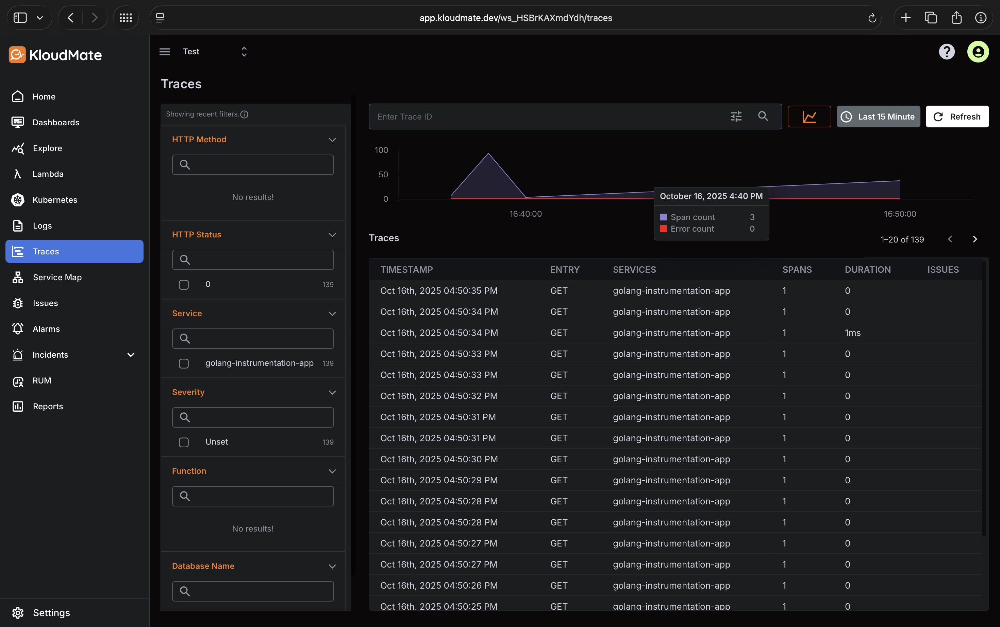
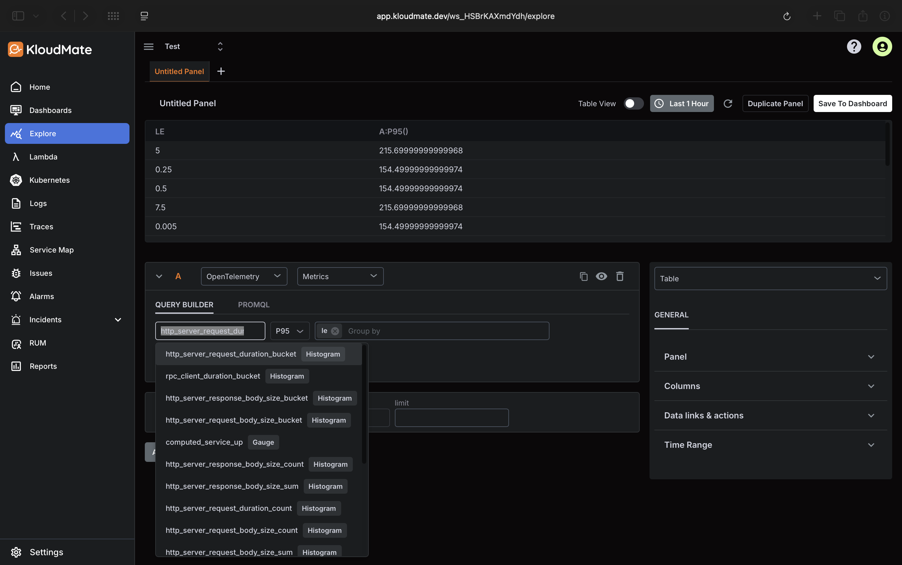

# Go + OpenTelemetry Auto Instrumentation Demo
This demo runs a Go service instrumented with OpenTelemetry Auto SDK using Docker Compose. This requires no code changes. The Go auto-instrumentation container needs access to the app binary and host privileges to collect telemetry data automatically.

## Requirements
* Docker & Docker Compose installed

## Setup

1. **Create a `.env` file** (or copy from `.env.example`) with the following content:
```env
OTEL_EXPORTER_OTLP_ENDPOINT=https://otel.kloudmate.dev:4318
OTEL_EXPORTER_OTLP_TRACES_HEADERS="Authorization=<PRIVATE_KEY_FROM_KLOUDMATE>"
OTEL_SERVICE_NAME=golang-instrumentation-app
OTEL_GO_AUTO_TARGET_EXE=/app/service
OTEL_PROPAGATORS=tracecontext,baggage
```
More environment variables can be found from https://opentelemetry.io/docs/languages/sdk-configuration/

2. **Run the demo**:

```bash
docker compose up --build
```

3. **Access the Go app**:

Open [http://localhost:8080](http://localhost:8080) or `/health` endpoint in your browser to generate some traces.

## Note
If you want to run without Docker on the same host, you first need to manually build the Go Auto Instrumentation binary and then run it alongside your Go application binary.

Refer to the official documentation for instructions:
https://github.com/open-telemetry/opentelemetry-go-instrumentation/blob/main/docs/getting-started.md#instrument-an-application-on-the-same-host

## Screenshots



